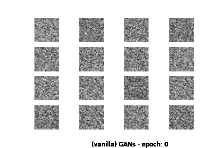

# Generative Adversarial Neural Networks (GANs)
In this series of notebooks we try different types of GANs for data augmentation. Under this repository you can find (in separate notebooks) implementations for [vanilla GANs](), Deep Convolutional GANs (DCGANs), Conditional GANs (CGANs), Auxiliary Classifier GANs (ACGANs) and Prescribed GANs (PresGANs). We use the Fashion MNIST dataset which contains 60,000 grayscale images of size 28x28, with 10 different classes of clothing and accessory items.

